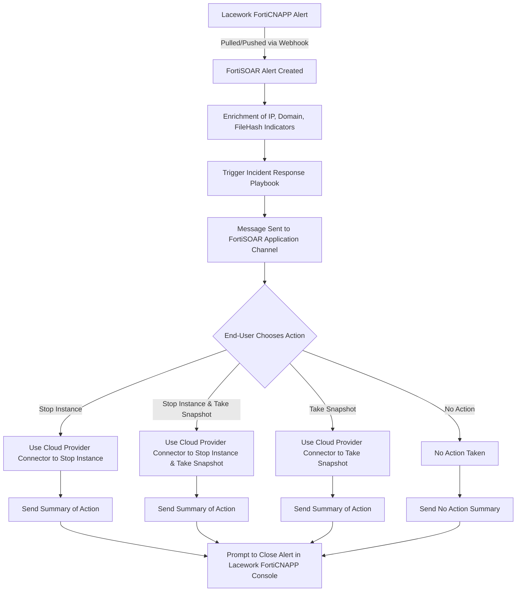

# Lacework FortiCNAPP Solution Pack Guide 

**Version**: 0.1.0 (Beta) 

**Date**: 2024.09.22 

## Overview  

The **Lacework FortiCNAPP Solution Pack** for FortiSOAR demonstrates an incident response flow for the "Potentially Compromised Host" composite alert. Alerts are either pulled or pushed (via webhook) into FortiSOAR, creating a local alert. Once the alert is created, IP, Domain, and FileHash indicators are enriched using configured sources (e.g., Fortinet FortiGuard Threat Intelligence connector). The incident response playbook is then triggered, prompting the user to select one of four actions: Stop Instance, Stop Instance & Snapshot, Take Snapshot, or No Action. FortiSOAR uses the appropriate cloud connector to execute the selected action and notifies the user upon completion, with a prompt to close the alert in the Lacework FortiCNAPP console. 

## FortiSOAR Connector Configuration 

The following Connector configurations are required to enable the end-to-end workflows provided by this solution pack. In cases where all three cloud providers (i.e. AWS, GCP, Azure) are not present at least one cloud provider connector is required.  

### AWS Compute Connector 

* **Permissions**: `ec2:StopInstances`, `ec2:StartInstances`, `ec2:DescribeInstances`, `ec2:CreateSnapshot`, `ec2:DescribeVolumes`   
* IAM role example:
```json   
  { 

 

  "Version": "2012-10-17",   
 

  "Statement": [   
 

	{ "Action": ["ec2:StopInstances", "ec2:StartInstances", "ec2:DescribeInstances"], "Effect": "Allow", "Resource": "*" },   
 

	{ "Action": ["ec2:CreateSnapshot", "ec2:DescribeVolumes"], "Effect": "Allow", "Resource": "*" }   
 

  ]   
 

}
```
 

* **Note**: Connector name must match the AWS account number integrated into Lacework. 

### Azure Commands Connector 

* **Permissions**: `Virtual Machine Contributor`, `Disk Snapshot Contributor `  
* **Note**: Connector name must match the lower-case Azure subscription name integrated into Lacework. 

### GCP Compute Connector 

* **Permissions**: `roles/backupdr.computeEngineOperator`  
* **Note**: Connector name must match the lower-case GCP project name integrated into Lacework. 

### Lacework FortiCNAPP Connector 

* **Permissions**: API key for a service account with admin user access (or a custom role that allows alert read/write)   
* **Configuration**: Create a service user in the Lacework console, download API keys, and configure the FortiSOAR connector with the subaccount name and the API keys.   
* **Note**: Connector name must match the lower-case subaccount name. 

### Slack Connector 

* **Requirements**: Install FortiSOAR for Slack and configure the Slack connector as described [here](https://docs.fortinet.com/document/fortisoar/1.0.0/fortisoar-for-slack-application/468/fortisoar-for-slack-application-v1-0-0). 

## Playbook Configuration 

### Lacework FortiCNAPP \> Alerts Webhook 

* **Setup**: Configure a webhook in the Lacework console (e.g., `https://<your-fortisoar-instance>/api/triggers/v1/deferred/<unique-GUID>`).   
* **Rule**: Create a new alert rule with Critical and High severity and Composite category.   
* **FortiSOAR Configuration**: Edit the webhook playbook in FortiSOAR, provide the same GUID, and validate via Lacework. 

### Lacework FortiCNAPP \> Potentially Compromised Host Alert Generate (Optional) 

* **Setup**: Pull alerts from Lacework using `lacework_account` and `lacework_subaccount` as parameters.   
* **Usage**: Playbook can be run manually or integrated into workflows. 

## First Run Configuration 

Playbooks in the solution pack are *Deactivated* by default, once configuration is complete the of the included playbooks should be *Activated*. To do this browse to the **SP \- Lacework FortiCNAPP v0.1.0 (Beta)** folder in ForitSOAR, select all playbooks and click the *Activate* button.

## Appendix 

### Playbook Workflow Diagram 

