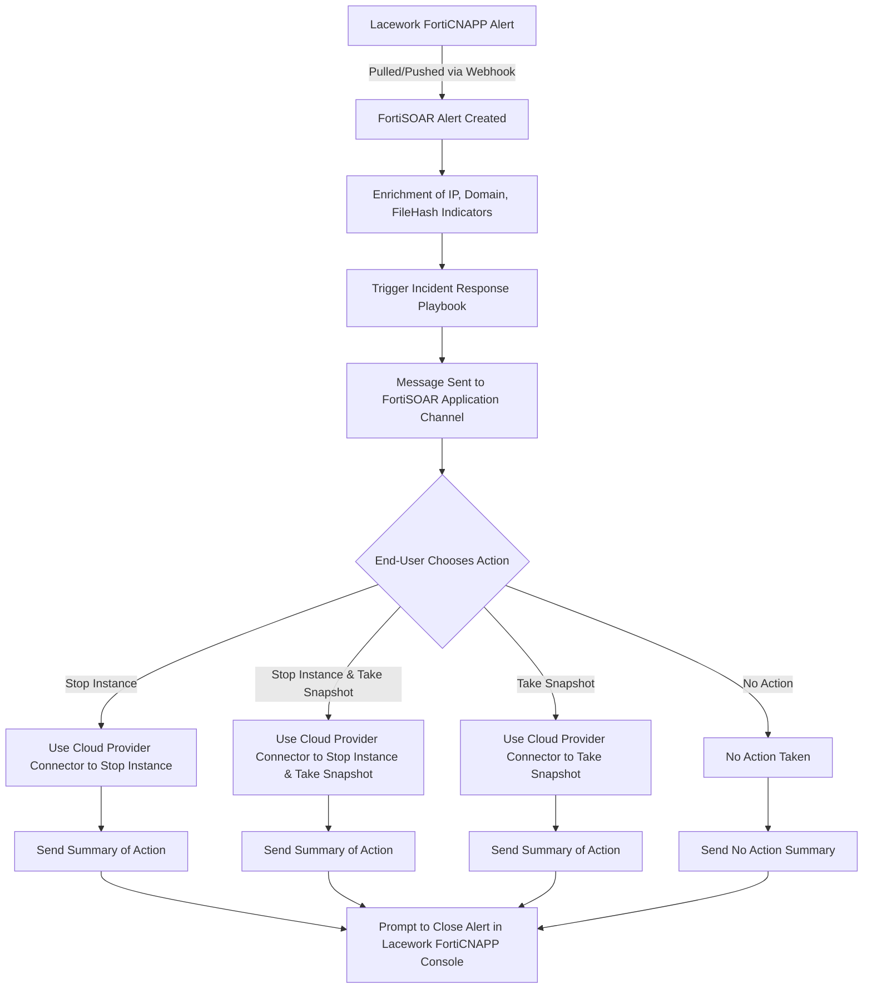

[Home](../README.md) |
 | -------------------------------------------- |

# Usage

## Playbook Configuration 

### Lacework FortiCNAPP \> Alerts Webhook 

* **Setup**: Configure a webhook in the Lacework console (e.g., `https://<your-fortisoar-instance>/api/triggers/v1/deferred/<unique-GUID>`).   
* **Rule**: Create a new alert rule with Critical and High severity and Composite category.   
* **FortiSOAR Configuration**: Edit the webhook playbook in FortiSOAR, provide the same GUID, and validate via Lacework. 

### Lacework FortiCNAPP \> Potentially Compromised Host Alert Generate (Optional) 

* **Setup**: Pull alerts from Lacework using `lacework_account` and `lacework_subaccount` as parameters.   
* **Usage**: Playbook can be run manually or integrated into workflows. 

## First Run Configuration 

Playbooks in the solution pack are *Deactivated* by default, once configuration is complete the of the included playbooks should be *Activated*. To do this browse to the **SP \- Lacework FortiCNAPP v0.1.0 (Beta)** folder in ForitSOAR, select all playbooks and click the *Activate* button.

## Appendix 

### Playbook Workflow Diagram 

# Next Steps
| [Installation](./setup.md#installation) | [Configuration](./setup.md#configuration) | [Contents](./contents.md) |
| ----------------------------------------- | ------------------------------------------- | --------------------------- |