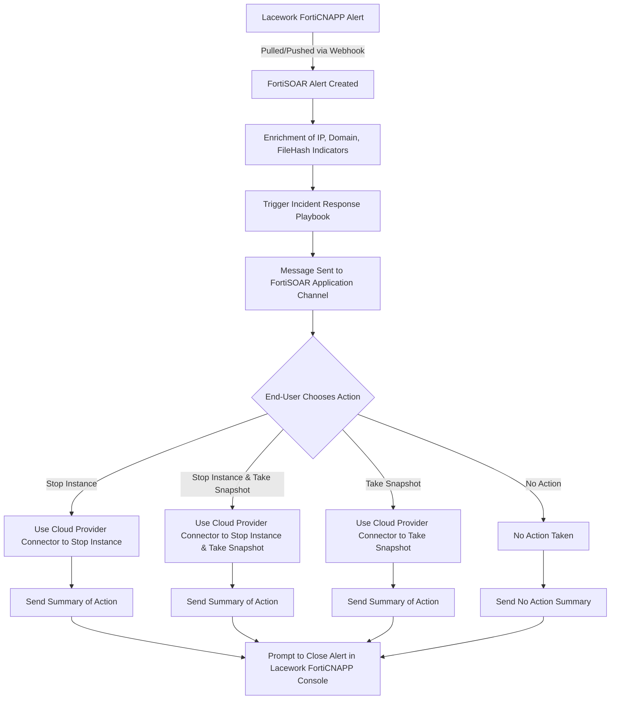

[Home](../README.md) |
 | -------------------------------------------- |

# Usage

## Playbook Configuration 

### FortiSOAR \> API Token

* **Overview** The alerts webhook playbook will use the configured FortiSOAR API token both to authenticate remote consumers and to execute the alerts webhook playbook itself. This is an important understanding especially with regards to configuring the assigned Role for the API Keys.
* **Key** In Settings > Security Management > API Keys create a new API key called "Lacework". Copy the value for the key as you will need it as part of the Lacework FortiCNAPP setup. 
* **Role** Either create a new Role or use an existing role for this API Key. Required permissions are:

    - **Alerts**: Create/Read/Update
    - **Application**: Read
    - **Indicators**: Create/Read/Update
    - **Playbooks**: Read/Execute

### Lacework FortiCNAPP \> Alerts Webhook 

* **Setup**: Configure a webhook in the Lacework console (e.g., `https://<your-fortisoar-instance>/api/triggers/v1/deferred/lacework_forticnapp_composite?api_token=<FORTISOAR API TOKEN>`).   
* **Rule**: Create a new alert rule with Critical and High severity and Composite category.

### Lacework FortiCNAPP \> Potentially Compromised Host Alert Generate (Optional) 

* **Setup**: Pull alerts from Lacework using `lacework_account` and `lacework_subaccount` as parameters. The Approval Action step will require a valid Slack email address. A placeholder value will need to be updated (default value is `<A VALID SLACK EMAIL ADDRESS>`)
* **Usage**: Playbook can be run manually or integrated into workflows. 

## Appendix 

### Playbook Workflow Diagram 

# Next Steps
| [Installation](./setup.md#installation) | [Configuration](./setup.md#configuration) | [Contents](./contents.md) |
| ----------------------------------------- | ------------------------------------------- | --------------------------- |