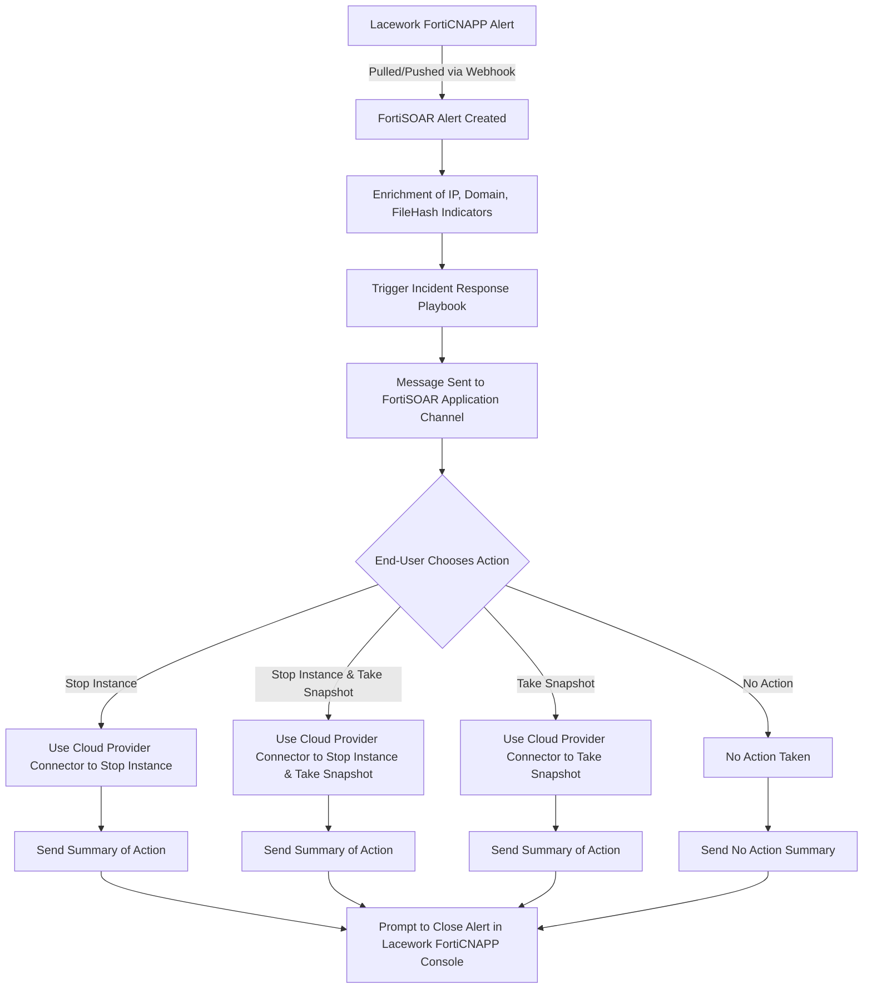

[Home](../README.md) |
 | -------------------------------------------- |

# Usage

## Playbook Configuration 

### FortiSOAR \> API Token

* **Overview** The alerts webhook playbook will use the configured FortiSOAR API token both to authenticate remote consumers and to execute the alerts webhook playbook itself. This is an important understanding especially with regards to configuring the assigned Role for the API Keys.
* **Key** In Settings > Security Management > API Keys create a new API key called "Lacework". Copy the value for the key as you will need it as part of the Lacework FortiCNAPP setup. 
* **Role** Either create a new Role or use an existing role for this API Key. Required permissions are:

    - **Alerts**: Create/Read/Update
    - **Application**: Read
    - **Indicators**: Create/Read/Update
    - **Playbooks**: Read/Execute

### Lacework FortiCNAPP \> Alerts Webhook 

* **Setup**: Configure a webhook in the Lacework console (e.g., `https://<your-fortisoar-instance>/api/triggers/v1/deferred/lacework_forticnapp_composite?api_token=<FORTISOAR API TOKEN>`).   
* **Rule**: Create a new alert rule with Critical and High severity and Composite category.

### Lacework FortiCNAPP \> Potentially Compromised Host Alert

* **Setup**: This playbook is repsonsible for starting chatops workflows in Teams/Slack. You'll need to have first configured the [FortiSOAR For Slack Application](https://docs.fortinet.com/document/fortisoar/1.0.0/fortisoar-for-slack-application/468/fortisoar-for-slack-application-v1-0-0) or the [FortiSOAR For Microsoft Teams Application](https://docs.fortinet.com/document/fortisoar/1.0.0/fortisoar-for-microsoft-teams-application/630/fortisoar-for-microsoft-teams-application-v1-0-0). Once configured use the `Set Slack and Teams Defaults` to enable to appropriate application and set the alert channel.

Additionally for the AWS `Block Internet` action an allow list regex for Security Groups _not to be removed_ from instances and expected containment security group name can be configured  in the `Set AWS Security Group Defaults` variables. Ensure the containment security group exists in all applicable VPC before applying remediation.

### Lacework FortiCNAPP \> Potentially Compromised Identity Alert

* **Setup**: This playbook is repsonsible for starting chatops workflows in Teams/Slack. You'll need to have first configured the [FortiSOAR For Slack Application](https://docs.fortinet.com/document/fortisoar/1.0.0/fortisoar-for-slack-application/468/fortisoar-for-slack-application-v1-0-0) or the [FortiSOAR For Microsoft Teams Application](https://docs.fortinet.com/document/fortisoar/1.0.0/fortisoar-for-microsoft-teams-application/630/fortisoar-for-microsoft-teams-application-v1-0-0). Once configured use the `Set Slack and Teams Defaults` to enable to appropriate application and set the alert channel inside the playbook itself.

Additionally for the AWS `Revoke Sessions` action ensure the fortisoar-revoke-session-policy exists in all applicable cloud accounts before applying remediation. The name of policy policy can be changed by updating the `Set AWS Policy Defaults` with a non-default value for `revoke_session_policy`. The value here should be the _name_ of the policy not arn as the workflow expects this policy is available in _each_ cloud account where remediation will take place. Use the following iam policy to configure this policy:  

    ```json
    {
        "Statement": [
            {
                "Action": [
                    "*"
                ],
                "Effect": "Deny",
                "Resource": "*",
                "Condition": {
                    "DateGreaterThan": {
                        "aws:TokenIssueTime": "1982-06-04T00:00:00Z"
                    }
                },
                "Sid": "RevokeActiveSessions"
            }
        ],
        "Version": "2012-10-17"
    }
    ```

### Lacework FortiCNAPP \> Potentially Compromised Host Alert Generate (Optional) 

* **Setup**: Pull alerts from Lacework using `lacework_account` and `lacework_subaccount` as parameters. The Approval Action step will require a valid Slack email address. A placeholder value will need to be updated (default value is `<A VALID SLACK EMAIL ADDRESS>`)
* **Usage**: Playbook can be run manually or integrated into workflows. 

## Appendix 

### Playbook Workflow Diagram 



# Next Steps
| [Installation](./setup.md#installation) | [Configuration](./setup.md#configuration) | [Contents](./contents.md) |
| ----------------------------------------- | ------------------------------------------- | --------------------------- |